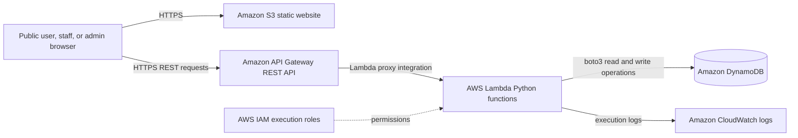

# Disaster Relief Resource Tracker

## Cloud-Based Application Using Amazon Web Services

**Course:** CSE2025 - AWS Solution Architect  
**Semester:** Fall 2026-27  
**Student Name:** [Enter your name]  
**Register Number:** [Enter your register number]  
**Faculty:** Dr Renita R  
**Submission Date:** [Enter submission date]

---

## Abstract

Disaster situations create an urgent need to coordinate relief centers, available resources, and requests from affected people. Manual coordination through phone calls, spreadsheets, or disconnected communication channels can delay assistance and make it difficult to identify shortages.

This project presents a serverless **Disaster Relief Resource Tracker** built using Amazon Web Services. The application allows members of the public to submit help requests, relief-center staff to maintain resource inventory, and administrators to monitor centers, requests, statistics, and low-stock resources. The frontend is hosted as static files in Amazon S3. Amazon API Gateway exposes REST endpoints, AWS Lambda executes the application logic, and Amazon DynamoDB stores operational data. AWS IAM controls permissions for Lambda functions, while Amazon CloudWatch provides execution logs.

The solution demonstrates a low-cost, scalable cloud architecture with separate responsibilities for presentation, API communication, business logic, and data storage. It is designed for an academic demonstration and can be extended with Amazon Cognito, API Gateway authorizers, CloudFront, pagination, and stronger concurrency controls for production use.

## 1. Introduction

During a disaster, people may require food, water, medical assistance, or temporary shelter. Relief organizations need a current view of registered relief centers, the resources available at each center, and unresolved requests in different locations. A system that connects these activities can improve visibility and help administrators prioritize urgent cases.

The Disaster Relief Resource Tracker is a browser-based cloud application designed to support these activities. It provides three main user experiences:

- **Public users** can submit a request for help without creating an account.
- **Relief-center staff** can sign in and update the inventory of their assigned center.
- **Administrators** can register centers, monitor requests, view statistics, identify low-stock resources, and update request statuses.

The application uses AWS managed services so that the project does not require a continuously running server. This reduces infrastructure management and is appropriate for a small demonstration workload.

## 2. Problem Statement

Disaster-relief information is often distributed across multiple people and locations. Without a central system, administrators may not know which centers are active, what resources are available, which requests are urgent, or where shortages exist. This can lead to delayed responses, duplicated effort, and inefficient use of relief supplies.

The problem addressed by this project is the lack of a simple, centralized, and cloud-accessible platform for recording public help requests, managing relief-center inventory, and supporting administrative coordination.

## 3. Objectives

The objectives of the project are:

1. To provide a public form for submitting disaster-relief requests.
2. To allow administrators to register and monitor relief centers.
3. To allow staff to view and update the inventory of their assigned center.
4. To classify requests by need type, location, and urgency.
5. To identify resources whose quantities are below their configured thresholds.
6. To track requests through pending, assigned, and resolved statuses.
7. To deploy the application using AWS managed and serverless services.
8. To apply IAM-based permissions so that backend functions can access required AWS resources.
9. To demonstrate an architecture that can be expanded for higher usage and stronger security.

## 4. Proposed Solution

The proposed solution is a three-role relief coordination platform:

### 4.1 Public user workflow

1. A user opens the public help-request page.
2. The user enters their name, location, type of need, urgency, description, and optional phone number.
3. The browser sends the request to the API Gateway REST API over HTTPS.
4. API Gateway invokes the request Lambda function.
5. The Lambda function validates the input and stores the request in the `HelpRequests` DynamoDB table.

### 4.2 Staff workflow

1. A staff member signs in through the login page.
2. The application identifies the staff role and assigned center.
3. The staff dashboard retrieves the center inventory.
4. Staff update quantities and minimum thresholds for food, water, medical supplies, and shelter resources.
5. The inventory Lambda updates DynamoDB and sets the low-stock flag when the quantity is below the threshold.

### 4.3 Administrator workflow

1. An administrator signs in through the login page.
2. The dashboard displays center, request, and inventory statistics.
3. The administrator can create relief centers and associated staff accounts.
4. The administrator can view requests and filter them by status or location.
5. Requests can be assigned and later marked as resolved.
6. Low-stock resources are displayed as operational alerts.

## 5. AWS Services Used

| AWS service        | Use in this project                                        | Justification                                                                      |
| ------------------ | ---------------------------------------------------------- | ---------------------------------------------------------------------------------- |
| AWS IAM            | Controls Lambda execution roles and DynamoDB permissions   | Provides identity and access management and supports least-privilege permissions.  |
| AWS Lambda         | Runs Python backend functions                              | Removes the need to manage servers and scales individual operations independently. |
| Amazon S3          | Hosts the static HTML, CSS, and JavaScript frontend        | Provides simple, low-cost static website hosting without a build server.           |
| Amazon DynamoDB    | Stores users, relief centers, inventory, and help requests | Provides managed NoSQL storage with fast key-based access and secondary indexes.   |
| Amazon API Gateway | Exposes REST API endpoints to the browser                  | Provides the HTTP entry point between the frontend and Lambda functions.           |
| Amazon CloudWatch  | Stores Lambda execution logs                               | Supports troubleshooting and observation of backend execution.                     |

The mandatory services required by the assessment are included: IAM, one compute service (AWS Lambda), one storage service (Amazon S3), and one database service (Amazon DynamoDB).

## 6. System Architecture

The architecture follows a serverless request flow:



### 6.1 Architecture workflow

1. The user loads the static frontend from Amazon S3.
2. Frontend JavaScript sends HTTPS requests to API Gateway.
3. API Gateway routes each request to the corresponding Lambda function.
4. Lambda receives the request event, validates the input, and performs the required operation using the AWS SDK for Python (`boto3`).
5. DynamoDB reads or writes the application data.
6. The Lambda response is returned through API Gateway to the browser.
7. Lambda execution information is written to CloudWatch Logs.

### 6.2 API endpoints

| Method | Endpoint                        | Lambda function         | Purpose                                                        |
| ------ | ------------------------------- | ----------------------- | -------------------------------------------------------------- |
| POST   | `/auth/login`                   | `login_user`            | Authenticates a user and returns role information.             |
| POST   | `/centers`                      | `create_center`         | Creates a relief center, staff account, and initial inventory. |
| GET    | `/centers`                      | `list_centers`          | Lists registered relief centers.                               |
| GET    | `/centers/{centerId}`           | `get_center`            | Retrieves one center.                                          |
| GET    | `/centers/{centerId}/inventory` | `get_inventory`         | Retrieves inventory for one center.                            |
| PUT    | `/centers/{centerId}/inventory` | `update_inventory`      | Updates a center resource quantity or threshold.               |
| GET    | `/inventory/low-stock`          | `get_low_stock`         | Retrieves resources below their thresholds.                    |
| POST   | `/requests`                     | `submit_request`        | Creates a public help request.                                 |
| GET    | `/requests`                     | `list_requests`         | Lists requests, optionally by status.                          |
| PUT    | `/requests/{requestId}`         | `update_request_status` | Updates assignment or resolution status.                       |
| GET    | `/stats`                        | `get_stats`             | Returns administrative summary statistics.                     |

## 7. Database Design

The application uses four DynamoDB tables. Separate tables were selected because they make the domain model clear and are easy to explain and demonstrate in an academic project.

### 7.1 `ReliefCenters`

- Partition key: `centerId`
- Stores center name, location, contact information, staff email, creation time, and active/inactive status.
- Global secondary index: `StaffEmail-index` on `staffEmail`.
- The index supports finding the center associated with a staff member.

### 7.2 `Inventory`

- Partition key: `centerId`
- Sort key: `resourceType`
- Stores quantity, unit, threshold, low-stock flag, and last-updated time.
- Global secondary index: `LowStock-index` on `lowStock` and `resourceType`.
- The composite key ensures that one center cannot have duplicate records for the same resource type.

### 7.3 `HelpRequests`

- Partition key: `requestId`
- Stores requester details, location, need type, urgency, description, contact phone, status, assigned center, and creation time.
- Global secondary index: `StatusUrgency-index` on `status` and `urgency`.
- Global secondary index: `LocationStatus-index` on `location` and `status`.
- Urgency is represented numerically: `1` is critical, `2` is high, `3` is medium, and `4` is low. This allows DynamoDB to sort urgent requests first.

### 7.4 `Users`

- Partition key: `email`
- Stores email, name, role, center association, password information, and creation time.
- Roles currently supported are `admin` and `staff`.

## 8. Application Implementation

### 8.1 Frontend

The frontend is implemented using plain HTML, CSS, and JavaScript. This choice avoids a build step and makes the files directly suitable for S3 static hosting.

- `index.html`: login page.
- `public-request.html`: public help-request form.
- `center-dashboard.html`: staff inventory dashboard.
- `admin-dashboard.html`: administrator dashboard.
- `api.js`: API Gateway URL and shared HTTP request helper.
- `auth.js`: session and role-based page guards.
- Dashboard-specific JavaScript files: page interaction and API response rendering.

### 8.2 Backend

The backend contains one Python Lambda handler for each major operation. The functions use `boto3` to communicate with DynamoDB. Keeping the functions separate follows a single-responsibility approach and makes each endpoint easier to deploy and troubleshoot.

The backend performs input validation, creates UUID-based identifiers, stores ISO 8601 timestamps, calculates low-stock state, and returns JSON responses with HTTP status codes.

### 8.3 Inventory alert logic

When a resource is updated, the application compares the current quantity with the configured threshold:

$$
lowStock =
\begin{cases}
\text{true}, & \text{if quantity} < \text{threshold}\\
\text{false}, & \text{otherwise}
\end{cases}
$$

The `LowStock-index` allows the administrator to retrieve low-stock items across centers for the dashboard.

## 9. IAM and Security Design

Lambda functions use IAM execution roles instead of storing AWS access keys in the application. The project documentation defines two logical roles for the demonstration:

- `LambdaReliefCenterRole`: used for center, inventory, user-login, and statistics operations.
- `LambdaRequestRole`: used for creating, listing, and updating help requests.

The roles require only the DynamoDB actions needed by the functions, such as `GetItem`, `PutItem`, `UpdateItem`, `Query`, and `Scan`, together with basic CloudWatch logging permissions.

The frontend does not contain AWS secret keys. API communication is performed through the API Gateway endpoint. CORS is configured so that the S3-hosted frontend can call the REST API.

For a production deployment, the simplified login implementation should be replaced with Amazon Cognito and API Gateway authorization. The current browser role checks and mock token are suitable only for this academic demonstration and should not be treated as a complete security boundary.

## 10. Deployment Procedure

The deployment consists of the following stages:

1. Select one AWS Region and enable account MFA and billing alerts.
2. Create the four DynamoDB tables and their global secondary indexes.
3. Create Lambda execution roles with DynamoDB and CloudWatch permissions.
4. Create and deploy the eleven Python Lambda functions.
5. Create an API Gateway REST API and configure the routes listed in Section 6.2.
6. Enable CORS and deploy the API to a stage such as `prod`.
7. Place the API Gateway invoke URL in `frontend/js/api.js`.
8. Create an S3 bucket with static website hosting enabled.
9. Upload only the contents of the `frontend` directory to the S3 bucket.
10. Seed an administrator account and test the application workflows.
11. Record AWS Console screenshots and the deployed website/API URLs for the final submission.

The deployed region, S3 website URL, API Gateway URL, Lambda function ARNs, and AWS account identifiers should be recorded from the student's AWS Console and inserted into the final submitted version of this report.

## 11. Testing and Validation

The following test cases should be performed before the demonstration:

| Test case                          | Expected result                                                     |
| ---------------------------------- | ------------------------------------------------------------------- |
| Open the S3 website                | Login and public request pages load successfully.                   |
| Submit a valid public request      | A unique request is stored and a success response is shown.         |
| Submit an incomplete request       | Validation prevents submission or the API returns an error.         |
| Login with valid admin credentials | The administrator dashboard opens.                                  |
| Login with valid staff credentials | The staff dashboard opens for the assigned center.                  |
| Create a relief center             | Center, staff account, and initial inventory records are created.   |
| Retrieve center inventory          | The center's resource records are displayed.                        |
| Update inventory above threshold   | The resource is saved with `lowStock = false`.                      |
| Update inventory below threshold   | The resource appears in the low-stock view.                         |
| View requests by status            | Requests are displayed according to the selected status.            |
| Assign and resolve a request       | The request status and assigned center are updated.                 |
| View administrator statistics      | Counts for centers, requests, and low-stock resources are returned. |
| Inspect CloudWatch logs            | Lambda execution logs are available for troubleshooting.            |

Local syntax validation can be performed with:

```powershell
python -m compileall lambda
Get-ChildItem frontend/js/*.js | ForEach-Object { node --check $_.FullName }
```

The final report should include screenshots or test evidence for successful API calls, DynamoDB records, the S3 website, Lambda functions, and the deployed user workflows.

## 12. Results

The implemented application provides the planned core workflow for disaster-relief coordination:

- Public users can submit categorized and prioritized help requests.
- Administrators can manage centers and inspect operational statistics.
- Staff can maintain center-specific inventory.
- Low-stock resources can be surfaced for administrative attention.
- Request records can be assigned and resolved.
- The frontend and backend are separated through API Gateway.
- The backend is composed of independently deployable Lambda functions.
- Persistent data is stored in DynamoDB rather than in browser storage.

After deployment, this section should be supplemented with the actual number of test centers, inventory records, and requests created during demonstration testing.

## 13. Limitations and Future Enhancements

The current implementation is intentionally sized for an academic demonstration. The following improvements would be required for production use:

1. Replace the simplified login and mock token with Amazon Cognito user pools and JWT validation through an API Gateway authorizer.
2. Add server-side authorization checks so a staff member can access only the assigned center.
3. Use password hashing such as bcrypt consistently, or delegate password handling to Cognito.
4. Add DynamoDB pagination using `LastEvaluatedKey` for requests, centers, and inventory queries.
5. Add conditional writes or optimistic locking to prevent conflicting inventory updates.
6. Enforce valid status transitions, such as `pending` to `assigned` to `resolved`.
7. Move API URLs, table names, and configuration into environment variables or infrastructure-as-code templates.
8. Add automated unit, integration, and API tests.
9. Use CloudFront and HTTPS for a stronger static website delivery configuration.
10. Add SNS notifications for urgent requests and low-stock alerts.
11. Add real-time updates through WebSocket API or AWS AppSync.
12. Consider DynamoDB Global Tables or a multi-region design for large-scale disaster response.

## 14. Demonstration Plan

The viva demonstration will follow this sequence:

1. Open the deployed S3 website.
2. Submit a public request with critical urgency.
3. Sign in as an administrator and show the request and dashboard statistics.
4. Register or display a relief center.
5. Sign in as staff and update an inventory item below its threshold.
6. Return to the administrator dashboard and show the low-stock alert.
7. Assign the request to a center and update it to resolved.
8. Open the AWS Console and explain S3, API Gateway, Lambda, DynamoDB, IAM, and CloudWatch.
9. Show that the architecture diagram matches the deployed resources.
10. Explain the limitations and possible production improvements.

## 15. Evidence Checklist

Attach the following evidence to the final submission:

- [ ] S3 bucket and static website hosting screenshot.
- [ ] Deployed website screenshot.
- [ ] API Gateway resources, methods, stage, and CORS screenshot.
- [ ] Lambda functions and successful test/execution screenshot.
- [ ] DynamoDB tables and active indexes screenshot.
- [ ] DynamoDB sample records for users, centers, inventory, and requests.
- [ ] IAM roles and policies screenshot.
- [ ] CloudWatch log group or execution log screenshot.
- [ ] Public request submission screenshot.
- [ ] Staff inventory update screenshot.
- [ ] Administrator statistics and low-stock screenshot.
- [ ] Request assignment and resolution screenshot.
- [ ] Final architecture diagram.
- [ ] Deployed URL and AWS Region: `[enter actual values]`.

## 16. Conclusion

The Disaster Relief Resource Tracker demonstrates how a real-world coordination problem can be addressed with a cloud-based serverless architecture. Amazon S3 hosts the user interface, API Gateway provides a REST interface, Lambda executes independent backend operations, and DynamoDB provides managed persistent storage. IAM controls backend permissions, while CloudWatch supports operational visibility.

The design satisfies the assessment requirement to use IAM, a compute service, a storage service, and a database service. It also demonstrates service selection, data modeling, API integration, role-based application workflows, and deployment planning. With stronger authentication, authorization, concurrency handling, observability, and automated deployment, the same foundation could be evolved into a more robust relief-management platform.

---

## References

1. Amazon Web Services, _AWS Lambda Developer Guide_.
2. Amazon Web Services, _Amazon DynamoDB Developer Guide_.
3. Amazon Web Services, _Amazon S3 Static Website Hosting Documentation_.
4. Amazon Web Services, _Amazon API Gateway Developer Guide_.
5. Amazon Web Services, _AWS Identity and Access Management User Guide_.
6. Project source code and deployment documentation included with this submission.
